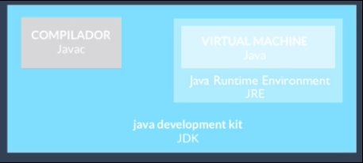
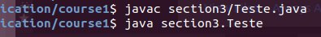

# Criando aplicações Java executáveis com um método main
- Toda classe chamada na linha de comando deve possuir o método **main**
    - para compilar: `javac` **nomeDoArquivo.java**
    - para rodar: `java` **nomeDaClasse** (que tem o método main)
    - deve ser da forma `public static void main(String[] args]) {}`
    - o array recebe os parâmetros que passo na linha de comando de execução
    - Posso rodar o método main de uma classe não pública.

- `javac:` compilador da própria Oracle, que vem com a _JDK (Java development kit)_
- Se eu quero só executar, sem compilar, eu baixo o _JRE (Java runtime Environment)_, a _virtual machine_ do Java.

- Existem opções pro compilador
    - por exemplo, especificando a versão: usando o `-source`

- É possível especificar o pacote na hora de executar um programa
    - para compilar: `javac` **pacoteDoArquivo/nomeDoArquivo.java**
    - para rodar: `java` **pacoteDaClasse.nomeDaClasse**

Ex.:

- Por vezes, durante a execução do programa, eu quero passar propriedades na linha de comando. Propriedades um pouco mais avançadas que vão configurar algo dentro do programa.

`java -Dsistema=producao -Dproduto=certificacao section3.Teste`: 
    variável sistema com valor "producao" e variável produto com valor "certificacao".
Assim, meu programa pode acessar esses valores através de variáveis.

###Como o java encontra as minhas classes?
**CLASSPATH:** variável que define a sequencia de diretórios, arquivos .jar ou .zips onde o Java procura as classes e pacotes em tempo de execução. Por padrão, é o diretório atual (**.**), mas é possível mudar com variáveis de ambiente. Se não especificar, ele usa o CLASSPATH variável de ambiente que, por padrão, é o diretório atual.

- No Linux, para separar diretórios, são `:` e no Windows é `;`
`CLASSPATH=.:/usr/libraries/arquivo.jar`

- Posso especificar o classpath na hora de executar a classe:
`java -classpath . section3.Teste`
`java -cp . section3.Teste`

- Assim, mudo o CLASSPATH de **duas** maneiras:
    - Pela variável global
    - `-classpath/-cp`

