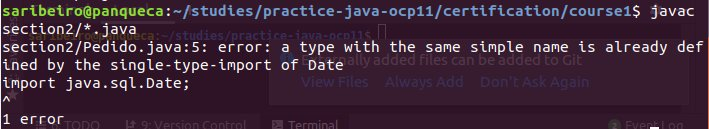

# Importando outros pacotes Java para torná-los acessíveis no meu código

## Pacotes e visilibidade

- quando eu tenho uma classe dentro de um pacote, eu posso acessar outras classes de outros pacote sem importá-las.

- imports são usados para não ter que digitar o fully qualified name

- asterisco(*) serve para importar todas as classes java do pacote em questão.

- se criar classe no pacote default, nenhuma outra classe de outro pacote vai conseguir acessar.

- não é possível importar subpacotes;
    - importo apenas os tipos daquele pacote

- `import static section2.Util.*;` importa todos os tipos estáticos daquela classe

**E se eu quero usar duas classes diferentes que tem o mesmo nome mas são de pacotes distintos?**
- Dá erro de compilação!

- Tenho que deixar explícito a classe que quero usar!

## Convenção para pacotes
- tudo em letra minúscula
- começa com o nome da empresa, equivalente a um site, ao contrário
- nome do projeto
- divisões que eu achar melhor