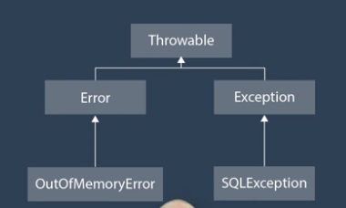
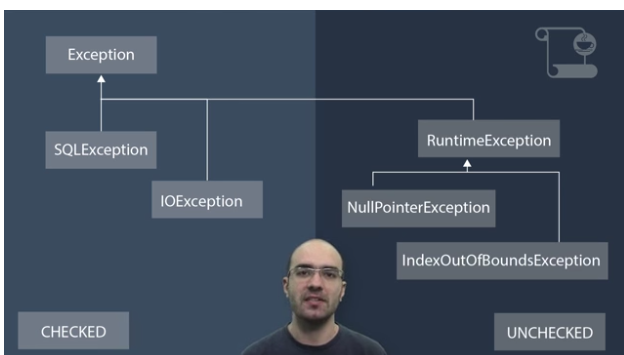

# Differentiate among checked exceptions, RuntimeExceptions and Errors

Throwable: qualquer classe que pode ser lançada pelo Java. Topo da hierarquia de errors.
Error: Erros de execução gerados por alguma situação anormal que aconteceu durante a execução da aplicação. Ex.: OutOfMemoryError. Não se espera que meu programa saiba se recuperar dela.
Exceptions: Erros que podem ser tratados, acontecem dependendo do fluxo de execução do meu programa. Ex.: SQLException. Podem ou não ser tratadas pela minha aplicação.

Dois tipos de Exceptions:
checked: São exceptions que não são simples de evitar ou lidar. Temos que estar preparados. Têm de ser lidadas. O compilador me obriga a fazer um tratamento da exceção.
unchecked: Erros mais simples de serem evitados. Todas as classes filhas de RuntimeException. Ex.: IndexOutOfBoundsException. O compilador ignora, não me obriga a tratar.

