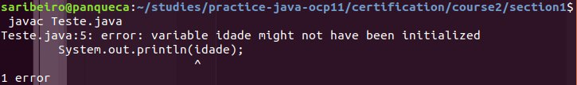
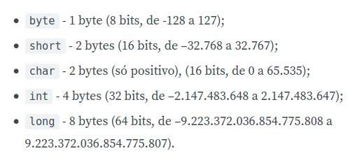
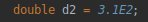
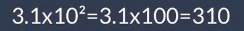

# Declaração e inicialização de variáveis

Sempre que quero armazenar valores, eu armazeno em **variáveis**.
 **Java: linguagem de programação tipada**, ou seja, todas as variáveis vão ter o tipo explícito ou, em algumas situações, implícito.

- A declaração é sempre feita baseada no **tipo e o nome**.
    - Antes de usá-la, é preciso inicializar seu valor, caso contrário, o Java não vai compilar e dará o seguinte erro:

    

- Variáveis locais não possuem valores default. Portanto, precisam ser inicializadas.
    - posso inicializar na declaração.
    - o compilador só permite a execução do programa se, por todos os caminhos que eu passar, a variável foi inicializada (imagine aqui vários **ifs**).

- Se a variável é de objeto, tem valor default!
    - Valor padrão de uma variável:
    
    Tipo   | Valor
    --------- | ------
    int, double, float, long, byte, short | 0
    char | valor em branco*
    boolean | false
    referência | null
    
> *caractere 0 - chars são numéricos, portanto, ele é de valor 0 que não é impresso para nós

- Valor default de um array é o valor default do tipo do array.

- ## Tipos primitivos

    Tipo   | Representação
    --------- | ------
    byte, short, char, int, long | inteiro
    float, double | ponto flutuante
    boolean | único que não é numérico

    - todos os tipos são positivos ou negativos exceção de char
    
        
        
        - byte vai do -128 a +127
        - char é [0,+inf[
        - short e char tem o mesmo tamanho

    - as variáveis de tipo de ponto flutuante podem assumir alguns valores especiais:
**+inf, -inf, +0, -0 e NaN**

        _Ex.:_  

- Para referências, não pode haver valor literal. Apenas para tipos primitivos.

- Numeros inteiros são considerados, por padrão, um int.
- Numeros com casa decimal, são considerados, por padrão, double.
- Posso forçar um valor literal para um tipo usando letras ao final do valor que fazem essa conversão
    - l ou L, para long
    - f ou F, para float
    - d ou D, para double
    - caso contrário, será um tipo int ou um double (dependendo se tem casa decimal ou não)

## Exceção:
- caso o int comece com 0:
    - é uma **representação octal** (base 8, depois do 0 permite valores de 0 a 7)
- caso o int comece com 0x/0X:
    - é uma **representação hexadecimal** (base 10, depois do x podem vir numeros do 0 ao 9 e letras A/B/C/D/E/F)
- caso o int comece com 0b/0B:
    - é uma **representação binária** (base 2, apenas dois caracteres: 0 e 1)

----------------------------------------

- Para os casos de ponto flutuante, existe representação científica:

 _é equivalente a_

- Se o numero é muito grande, posso usar _ como separador de casas, com algumas restrições:
    - nas duas pontas extremas não podem ter _
    - precisa existir um número, algarismo ou caractéres que dão valor real ao número nas duas pontas do _
    - posso ter mais de um _ juntos

- Char: nem todos os números tem equivalencia com uma letra
    - pode ser inicializado utilizando unicode
        - adiciona um \u, entre aspas simples, e adiciona o valor unicode de um caracter

## Identificador:
nome utilizado para identificar variáveis, métodos, construtores, classes, interfaces, pacotes e etc..

- existem regras definidas para esses nomes:
    - não pode usar palavra reservada
    - não pode começar com número
    - posso usar letras do unicode
    - posso ter números
    - posso ter cifrão
    - posso ter _
    - padrão é camelCase
    - todos são case sensitive
    
    

