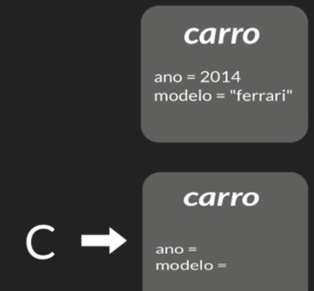

#Ciclo de vida dos objetos


##Três possíveis estágios:
- Novo objeto, referência
- Não referênciado
- Deixa de existir, jogado fora da memória

1. Para criar um objeto, é preciso criar um construtor.

```new Carro();``` é um Carro na memória portanto a variável de atribuição referencia a este Carro que está em memória.
   
Se nenhuma variável mais referencia aquele objeto, então ele é inacessível.



Formas de ter objetos inacesśiveis:
- null;
- objeto com referencia para outro objeto;
- objetos fora de seu escopo de definição;

Ou seja:
- Criado: construtor
- Acessível: enquanto é referenciado diretamente ou indiretamente
- Inacessível: sem referencias diretas ou indiretas


2. Deixando de existir
Garbage Collector: coleciona o lixo, tira da memória, pode jogar fora os objetos a qualquer instante depois que se tornaram inacessíveis.
   
Por padrão, não tem como saber quando ele vai rodar.