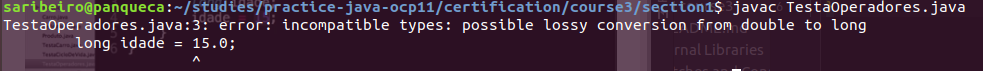

# Usando operadores no Java

## Operador de atribuição

Quero pegar um valor e atribuir para alguem. No Java, é o **=**.

- **para o caso de primitivos:** A atribuição se refere ao valor passado.

O compilador confere se a expressão do lado direito é menos abrangente do que a do lado esquerdo.
Por exemplo, se tento atribuir um `double` para um `long`:

`byte -> short/char -> int -> long
float -> double`

**char é apenas positivo**

- **para o caso de boolean:** Apenas de um valor booleano para outro.

- **para o caso de objetos:** A referência é por atribuição.
