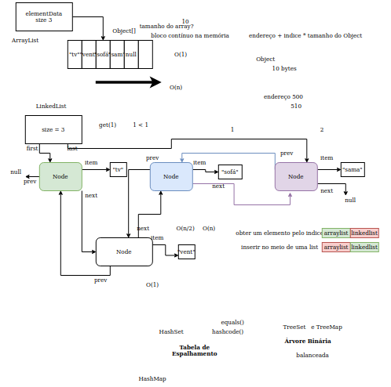

# Use ArrayList

- O _tamanho do ArrayList é mutável_, dinâmico! O array não. Essa é a **maior vantagem** do ArrayList sob o array.

_Generics:_ indica que uma coleção é de certo <Tipo>.

- **add():** Adiciona elementos no array
    - Sem o índice, adiciona o item no final. Quando passamos um índice como parâmetro, ele insere no índice desejado. 
    - Inclui o elemento e desloca o resto da lista pra frente
- **remove():** Remove uma ocorrência do objeto
    - Assim como o add, o remove possui outras sobrecargas também.
- **contains():** Verifica se um item contém no array
- **size():** Verifica quantos elementos existem no array
- **toArray():** Converte o ArrayList para um array de Objects.
- **get():** Recupera o ítem em um ceryo índice
- **addAll():** Adiciona vários item de uma vez em uma lista.
- **set():** Um pouco diferente do add. Troca o elemento que esta naquela posição pelo novo elemento.
- **indexOf():** Fala em qual posição daquele ArrayList aquele elemento está.
    - A primeira posição que aparece.
    - Sempre que o indexOf não encontrar um elemento, ele retorna -1.
- **lastIndexOf():** Mesma coisa que o indexOf, mas olha a lista de tras pra frente. Assim, acha a última posição que o elemento está.

Agradecimentos ao Alexandre Aquiles (@alexandreaquiles) pela belíssima explicação.

