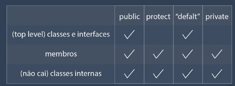

# Apply access modifiers

public: mais aberto, mais acessível
protected: Todos dentro de mim, me herda ou no mesmo pacote me acessa.
default: Todos dentro do mesmo pacote ou dentro de mim para poder me acessar. É implícito, não precisa escrever.
private: Todos dentro de mim para poder me acessar.

- Onde usar?

  
